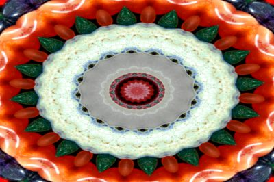
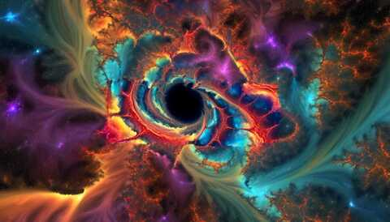

# Kaleidoscope

A [frei0r](https://frei0r.dyne.org "frei0r") plugin to produce a kaleidoscope effect.

Written by Brendan Hack. Original source repository at [https://github.com/gbendy/kaleidoscope](https://github.com/gbendy/kaleidoscope "https://github.com/gbendy/kaleidoscope").

| ["Colorful Stones"](https://www.flickr.com/photos/82955120@N05/7995277667 "Colorful Stones") by ["Bold Frontiers"](https://www.flickr.com/photos/82955120@N05 "Bold Frontiers") | kaleid0sc0ped |
| - | - |
|   |   |
|Licensed under [CC BY 2.0](https://creativecommons.org/licenses/by/2.0/?ref=ccsearch&atype=html "CC BY 2.0") | Segmentation 16, source segment centred to top right|

| Source Image | ["New Years Day 2024"](https://www.youtube.com/watch?v=9tZwRUTyD08 "New Years Day 2024)") (YouTube)|
| - | - |
|   |   |
| Video created from single source image via zoom/rotate/pan and kaleidoscope animation | Animated Music Video created in [KdenLive](https://kdenlive.org) by [Paul Haesler](https://www.youtube.com/@PaulHaesler) |

| [Created Many and Strange (Official Music Video)](https://www.youtube.com/watch?v=2r9ggSie1wI) (YouTube) by [Spaceman Paul](https://github.com/SpacemanPaul "Spaceman Paul") |
| --- | 
|  |
| Animated Music Video created in [KdenLive](https://kdenlive.org) by [Spaceman Paul](https://www.youtube.com/channel/UCBVFfRZw4Vbk3j6mNCukztg) |

Allows for specification of number of segments (mirrors), auto selection of optimal source reflection segment, placement of origin and much more!

# Parameters

1. `origin_x` `(float=0.5)` - Origin of the kaleid0sc0pe in x. Range `[0, 1]`.
2. `origin_y` `(float=0.5)` - Origin of the kaleid0sc0pe in y. Range `[0, 1]`.
3. `segmentation` `(float=16/128)` - The kaleid0sc0pe effect is broken into `segmentation * 128` segments. Segmentations of 1, 2 or multiples of 4 work best. Range `[0, 1]`.
4. `specify_source` `(bool=false)` - If `true` then the source segment for the mirror is specified by `source_segment`. Otherwise the furthest corner from the origin is used as the source segment and the segment's orientation is defined by `segmentation_direction`. When multiple corners are the same distance the tie is broken according to the `preferred_corner` and `corner_search` parameters.
5. `source_segment` `(float=0)` - Normalized angle that specifies the centre of the source segment if `specify_source` is `true`. `0` is in `+x` and rotates counter clockwise. Range `[0, 1]`.
6. `segmentation_direction` `(float=1)` - When `source_segment` is `false` the source segement is either centred on the corner (< `1/3`), extends counter clockwise from the corner (< `2/3`) or clockwise from the corner (>= `2/3` the default). Range `[0, 1]`.
7. `reflect_edges` `(bool=true)` - If `true` then reflections that end up outside the frame reflect back into it, otherwise the colour specified in `bg_color` is used.
8. `edge_threshold` `(float=0)` - if `reflect_edges` is `false` then reflections outside the frame but within `edge_threshold * 4` pixels of the frame clamp to the edge value rather than use the background color. Range `[0, 1]`. 
9. `preferred_corner` `(float=0)` - The preferred corner when breaking ties when searching for the furthest corner. Searching starts in this corner and proceeds in the direction given in `corner_search`. The first and furthest corner found wins. Supported values are `0`: top right (default), `0.25`: top left, `0.5`: bottom left, `0.75`: bottom right.
10. `corner_search` `(bool=true)` - If `true` search clockwise for furthest corner, otherwise counter clockwise.
11. `bg_color` `(color=1,0,1)` - Color used when reflections end up outside the frame and `reflect_edges` is `false`.
12. `bg_alpha` `(float=1)` - Alpha value to use when reflections end up outside the frame and `reflect_edges` is `false`. Range `[0, 1]`.
13. `multithreaded` `(bool=true)` - If `true` then processing is multithreaded.
14. `n_threads` `(float=0)` - If `multithreaded` is `true` then the number of threads to use. `0` autocalculates otherwise `n_threads * 32` threads are used. Range `[0, 1]`.

# Contributors

This filter exists thanks to all the people who contribute.

- [Brendan Hack](https://github.com/gbendy "Brendan Hack")
- [Spaceman Paul](https://github.com/SpacemanPaul "Spaceman Paul")
